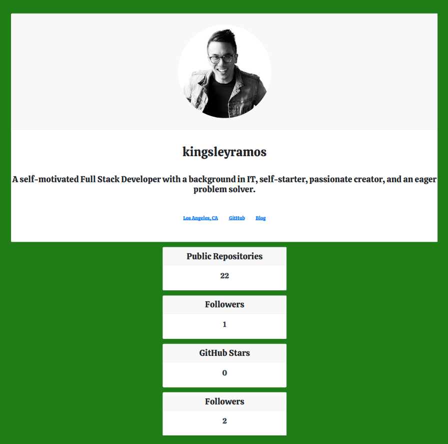
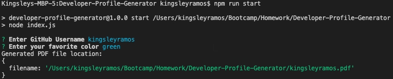
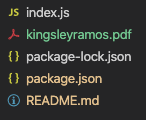

# Developer-Profile-Generator

This simple Node application generates a PDF file from a Github username and inputting a color. The PDQ will output in the root folder. The application generates the profile in HTML and converts the HTML to a PDF file.

## Usage
---
1. Run `npm install` to install all dependencies
2. Run `npm run start` to start the application
3. Under desired GitHub username to generate a PDF file for.
4. Enter desired color, e.g. blue. Press Enter and the PDF will generate after a few seconds
    
    

5. check the root folder for [GitHub Username].pdf

    

## Dependencies
 * [Axios]() - To create API calls using Github API
 * [html-pdf]() - To convert HTML to PDF
 * [inquirer]() - To prompt users for information in the CLI

## Assignment Challenges
---
### Axios

The largest challenge was trying to understand how the axios returned data and how to place the returned object or array in a variable. I have found that the response containers different information:

* `response.data`
* `response.status`
* `response.statustext`
* `response.headers`
* `response.config`

### CSS

Even though HTML and CSS was the first subjects we learned, it was difficult trying to remember all the different styles of CSS and how to build them. Building the CSS and HTML took a large chunk of time relearning everything from week 1.

### html-pdf Node Module

I have having trouble on how to user this module. It kept enlarging the HTML and it would fit to two pages every time. I found from a classmate that there are parameters that can be be set. At first doing 8.5 x 11 was too small so I played around with pixels width and length with the same 8.5 x 11 ratio and found 2000px x 1455 worked out.